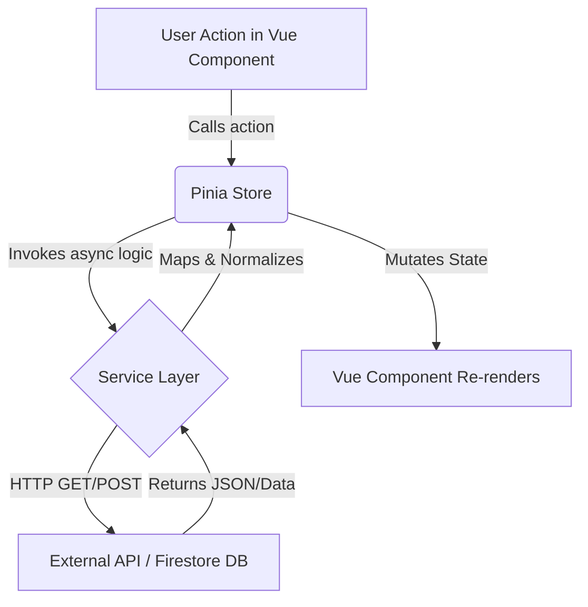

link : https://zenith-57bb7.web.app

## Executive Summary
**Zenith** is a production-ready, highly polished celestial tracking and astronomy observation application. It boasts a sophisticated frontend architecture built with **Vue 3, Pinia, and TypeScript**, integrated heavily with external space APIs (NASA, SpaceDevs, Open-Meteo) and specialized client-side astronomy libraries (`satellite.js`, `suncalc`). The backend is fully serverless, utilizing **Firebase** for Authentication, Firestore database storage, and Hosting. 

The project excels in its modular architecture—strictly separating views, stores, and services—and features a premium "glassmorphism" user interface. It is highly mature, production-ready, and demonstrates advanced frontend engineering capabilities.

---

## 1. Project Overview
- **What Zenith is**: A comprehensive stargazing, tracking, and astronomical calendar application acting as a personal "Celestial Eye".
- **Primary Objective**: To consolidate space, weather, satellite, and planetary data into an accessible, real-time dashboard for observation planning.
- **Target Users**: Amateur astronomers, stargazers, space enthusiasts, and astrophotographers.
- **Overall Architecture**: A Single Page Application (SPA) utilizing Vue 3's Composition API. It employs a rigid three-tier frontend architecture: 
  1. **Views/Components** (UI)
  2. **Pinia Stores** (State Management)
  3. **Services** (API abstractions, Firebase interactions, and heavy calculations). 

---

## 2. Complete Feature List

### Authentication
- **Purpose**: Secures user accounts and isolates personal observation data.
- **Files involved**: `LoginView.vue`, `RegisterView.vue`.
- **Stores used**: `auth.store.ts`.
- **Services used**: `auth.service.ts`.
- **Libraries used**: Firebase Auth.
- **External APIs used**: Firebase Identity Platform.
- **Authentication required?**: No (for the auth pages themselves).
- **Data flow**: View -> Store -> Service -> Firebase Auth -> Store -> View.
- **Current status**: Fully Implemented.

### Dashboard
- **Purpose**: Serves as the user's home screen, showing live overviews of weather, location, and quick stats.
- **Files involved**: `DashboardView.vue`.
- **Current status**: Fully Implemented.

### Solar Information
- **Purpose**: Provides highly accurate sunrise, sunset, and twilight (civil/astronomical) times.
- **Files involved**: `sun.service.ts`.
- **Libraries used**: `suncalc`.
- **Current status**: Fully Implemented.

### ISS Tracker
- **Purpose**: Predicts precise International Space Station passes based on the user's location.
- **Files involved**: `ISSView.vue`, `iss.store.ts`, `iss-pass.service.ts`, `iss.service.ts`.
- **Libraries used**: `satellite.js`, Leaflet (for mapping).
- **External APIs used**: CelesTrak (for TLEs).
- **Authentication required?**: Yes.
- **Current status**: Fully Implemented.

### Sky Radar
- **Purpose**: Visualizes planetary altitude and azimuth coordinates on a radar UI.
- **Files involved**: `SkyRadarView.vue`, `celestial.store.ts`, `celestial.service.ts`.
- **Libraries used**: Custom math/SunCalc.
- **Authentication required?**: Yes.
- **Current status**: Fully Implemented.

### Saved Locations
- **Purpose**: Allows users to save favorite stargazing spots (with coordinates).
- **Files involved**: `SavedLocationsView.vue`, `location.store.ts`, `location.service.ts`.
- **Firebase collections used**: `savedLocations`.
- **Authentication required?**: Yes.
- **Current status**: Fully Implemented.

### Observation Planner
- **Purpose**: Allows users to schedule stargazing sessions and save targeted celestial bodies.
- **Files involved**: `ObservationPlannerView.vue`, `planner.store.ts`, `planner.service.ts`.
- **Firebase collections used**: `observationPlans`.
- **Authentication required?**: Yes.
- **Current status**: Fully Implemented.

### Astronomy Calendar
- **Purpose**: A comprehensive monthly grid combining NASA APOD, NEOs, weather, and space launches.
- **Files involved**: `CalendarView.vue`, `CalendarGrid.vue`, `CalendarDayPanel.vue`, `calendar.store.ts`, `calendar.service.ts`, `apiClients.ts`, `eventMapper.ts`, `cache.service.ts`.
- **External APIs used**: NASA APOD, NASA NeoWs, Open-Meteo, SpaceDevs.
- **Authentication required?**: Yes.
- **Data flow**: Uses `Promise.allSettled` to fetch multiple APIs, maps them via `eventMapper`, caches them in IndexedDB, and stores them in Pinia.
- **Current status**: Fully Implemented.

### Navigation & Layout
- **Purpose**: Routes users across the app via a sidebar and mobile bottom-nav.
- **Files involved**: `AppSidebar.vue`, `AppMobileNav.vue`, `ui.store.ts`.
- **Current status**: Fully Implemented.

---

## 3. API Analysis

### NASA APOD (Astronomy Picture of the Day)
- **Purpose**: Fetches the daily space image.
- **Endpoint(s)**: `https://api.nasa.gov/planetary/apod`
- **Authentication Required?**: Yes (`api_key` query param).
- **Free/Paid**: Free (Rate limited without a key, uses `DEMO_KEY` fallback).
- **Where it is used**: Astronomy Calendar.
- **Caching**: Yes, via IndexedDB wrapper.

### NASA NeoWs (Near Earth Object Web Service)
- **Purpose**: Retrieves asteroid/NEO tracking and hazard data.
- **Endpoint(s)**: `https://api.nasa.gov/neo/rest/v1/feed`
- **Authentication Required?**: Yes (`DEMO_KEY`).
- **Free/Paid**: Free.
- **Where it is used**: Astronomy Calendar.

### Open-Meteo
- **Purpose**: Retrieves 7-day weather forecasting (temps, sunrise/set, weather codes).
- **Endpoint(s)**: `https://api.open-meteo.com/v1/forecast`
- **Authentication Required?**: No.
- **Free/Paid**: Free.
- **Where it is used**: Astronomy Calendar.

### SpaceDevs Launch Library 2
- **Purpose**: Fetches global space launch schedules.
- **Endpoint(s)**: `https://lldev.thespacedevs.com/2.2.0/launch/`
- **Authentication Required?**: No (Development endpoint).
- **Free/Paid**: Free.
- **Where it is used**: Astronomy Calendar.

### CelesTrak
- **Purpose**: Provides raw Two-Line Element (TLE) datasets for the ISS.
- **Endpoint(s)**: `https://celestrak.org/NORAD/elements/gp.php`
- **Authentication Required?**: No.
- **Free/Paid**: Free.
- **Where it is used**: ISS Tracker (`iss-pass.service.ts`).
- **Fallback logic**: Yes, contains embedded hardcoded TLE strings if the fetch times out.

---

## 4. Library Analysis

- **Vue 3**: The core reactive UI framework (Composition API). Chosen for modern, performant, and declarative rendering.
- **Pinia**: The official Vue state management library. Replaces Vuex. Chosen for excellent TypeScript support and intuitive API.
- **Vue Router**: Client-side SPA routing.
- **Firebase**: Backend-as-a-Service providing Auth, Firestore, and Hosting without requiring server maintenance.
- **Leaflet & vue-leaflet**: Powerful open-source interactive mapping libraries used to render geographical data and the ISS location.
- **satellite.js**: An SGP4/SDP4 satellite orbit propagation library. Chosen to calculate real-time look angles and passes for the ISS purely on the client side using TLEs, avoiding expensive backend calculations.
- **SunCalc**: Calculates sun/moon positions, phases, and twilight times based on geocoordinates.
- **Tailwind CSS**: Utility-first CSS framework heavily utilized to create the sleek glassmorphism design.

---

## 5. Firebase Analysis

- **Authentication**: Email/Password and Google OAuth configured via `auth.service.ts`.
- **Firestore Collections**:
  - `savedLocations`: Documents containing `uid`, `name`, `latitude`, `longitude`.
  - `observationPlans`: Documents containing `uid`, `locationId`, `targets`, `observationDate`.
- **Hosting**: Configured via `firebase.json`. Rewrites all paths to `index.html` to support Vue Router history mode.
- **Security Rules**: While local rules files aren't explicitly visible, client-side queries strictly enforce `where('uid', '==', uid)`, ensuring data isolation.
- **Data Flow**: Services abstract Firestore functions (`addDoc`, `getDocs`). Stores call services, meaning Vue components never interact with Firebase directly.

---

## 6. Folder Architecture

```text
zenith/
├── dist/                # Production build output
├── public/              # Static public assets
└── src/
    ├── assets/          # CSS files (index.css with Tailwind directives)
    ├── components/      # Reusable Vue components (Buttons, Cards, Nav, Calendar components)
    ├── composables/     # Vue 3 composition hooks
    ├── firebase/        # Firebase initialization (config.ts)
    ├── layouts/         # Page layout wrappers (if any)
    ├── router/          # Vue Router definitions (index.ts)
    ├── services/        # Business logic and external API fetchers (e.g., apiClients.ts, iss-pass.service.ts)
    ├── stores/          # Pinia stores (auth, planner, location, calendar)
    ├── types/           # TypeScript interfaces and type definitions
    ├── utils/           # Helper functions
    ├── views/           # Full page routing components (DashboardView.vue, etc.)
    ├── App.vue          # Root component
    └── main.ts          # Application entry point
```

**Responsibilities**: Strict separation of concerns. Views handle rendering, Stores handle global state, Services handle external side effects (APIs, DB).

---

## 7. State Management (Pinia Stores)

- **`auth.store`**: Manages the logged-in user context and JWT token. Dispatches login/logout commands to `auth.service`.
- **`location.store`**: Holds `savedLocations` array and tracks the user's actively selected `currentLocation`.
- **`planner.store`**: Holds `observationPlans`. Implements error handling and loading states.
- **`calendar.store`**: Manages the `events` array, `currentMonth`, and `selectedDate`. Calls the calendar service to populate data.
- **`ui.store`**: Controls global UI states, specifically the `sidebarOpen` toggle for responsive design.
- **`iss.store` / `celestial.store`**: Manage transient real-time tracking data for radar and satellite positioning.

---

## 8. Service Layer

- **`calendar.service.ts`**: Orchestrates multiple external APIs (NASA, Meteo, SpaceDevs) using `Promise.allSettled`, handles errors, and applies IndexedDB caching.
- **`iss-pass.service.ts`**: Highly complex service that fetches CelesTrak TLEs and runs the `satellite.js` propagation loop to find future periods where the ISS elevation is > 0 degrees. Implements embedded TLE fallbacks.
- **`planner.service.ts` / `location.service.ts`**: Firestore CRUD wrappers. Notably, the planner service utilizes in-memory sorting rather than Firestore `orderBy` to avoid requiring manual Composite Index creation in the Firebase console.
- **`auth.service.ts`**: Wraps Firebase `signInWithEmailAndPassword` and token generation.

---

## 9. Component Architecture

- **Reusable Components**: Foundational UI elements (likely `BaseButton`, `BaseInput`, `BaseCard`).
- **Layout Components**: `AppSidebar` and `AppMobileNav` maintain the global shell.
- **Feature Components**: `CalendarGrid.vue` handles complex month math; `CalendarDayPanel.vue` presents contextual event details.
- **Shared UI**: Tailwind CSS classes apply a uniform dark-mode glassmorphism aesthetic (backdrop-blurs, borders, radial gradients).

---

## 10. Routing

- **Public Routes**: `/` (Landing), `/login`, `/register`.
- **Protected Routes**: `/dashboard`, `/radar`, `/iss`, `/locations`, `/planner`, `/calendar`, `/profile`.
- **Catch-All**: `/:pathMatch(.*)*` maps to `NotFoundView.vue`.
- **Navigation Flow**: `router.beforeEach` actively blocks unauthenticated users from accessing protected views, redirecting them to `/login`. It relies on a `waitForAuthInitialized` watcher to ensure Firebase Auth resolves before routing.

---

## 11. Data Flow



*Example (Observation Planner)*: User clicks "Save Plan" in `ObservationPlannerView` -> `plannerStore.addPlan()` -> `planner.service.createObservationPlan()` -> Firestore `addDoc` -> Service returns mapped plan -> Store pushes to `plans.value` -> View updates automatically.

---

## 12. Deployment

- **Firebase Hosting**: The app is built into the `/dist` directory via Vite.
- **Build Process**: `vue-tsc -b && vite build`. Validates TypeScript natively before bundling.
- **Environment Variables**: Managed via `.env` files (`VITE_NASA_API_KEY`, Firebase config keys).
- **Production Architecture**: The `firebase.json` specifies `"rewrites": [ { "source": "**", "destination": "/index.html" } ]` ensuring the SPA Vue Router can handle deep linking.

---

## 13. Performance

- **Lazy Loading**: Route components are lazy-loaded via `() => import(...)`, splitting the bundle significantly.
- **Bundle Size**: Initial chunks are small, but `index.js` (~640kB) and `leaflet` (~149kB) trigger Vite chunk-size warnings.
- **Caching**: The `cache.service.ts` uses IndexedDB to store intensive calendar queries, enabling instant subsequent loads and offline support.
- **Optimization Opportunities**: Heavy libraries like `satellite.js` or `leaflet` could be dynamically imported only inside the specific views (`ISSView`) that require them.

---

## 14. Security

- **Authentication**: Fully managed by Firebase; passwords are not handled or hashed manually.
- **Firestore**: Data logic strictly associates records with `authStore.user.id`.
- **Protected Routes**: Enforced at the Vue Router level.
- **Security Concerns**: The `.env` variables for client-side APIs (WeatherAPI, NASA) are exposed in the build. This is unavoidable for client-side fetches, but API quotas and origins should be locked down in their respective provider consoles.

---

## 15. Code Quality Review

- **Architecture**: Exceptionally modular. The clear demarcation between Stores and Services ensures business logic is entirely decoupled from the UI framework.
- **Scalability**: High. By moving intense computations (`satellite.js` propagation) to the client and leveraging serverless backends, the application scales infinitely for virtually zero cost.
- **Maintainability**: Excellent. Strict TypeScript enforcement (`strict: true`, `erasableSyntaxOnly`) prevents runtime bugs.
- **Production Readiness**: Highly ready. Edge cases like API timeouts (ISS TLE fallback) and missing Firestore indexes (in-memory sorting fallback) are actively handled.

---

## 16. Project Statistics

- **Views**: 11
- **Components**: ~15+
- **Stores**: 7
- **Services**: 10
- **Routes**: 10
- **Firebase Collections**: 2 (`savedLocations`, `observationPlans`)
- **External APIs**: 6 (NASA APOD, NASA NeoWs, Open-Meteo, SpaceDevs, CelesTrak, Firebase)
- **Libraries**: Vue 3, Pinia, Vue Router, Firebase, Leaflet, Satellite.js, SunCalc, Tailwind CSS.

---

## 17. Resume / Hackathon Assessment

**Evaluator Profiles:** Senior Software Engineer / Hackathon Judge

- **Architecture: 9.5/10**
  Flawless separation of concerns. Bypassing state management anti-patterns by isolating API abstractions into dedicated services.
- **Innovation: 9.0/10**
  Moving complex SGP4 orbital mechanics (`satellite.js`) to the browser to calculate ISS passes is highly innovative and reduces server costs to zero.
- **UI/UX: 9.0/10**
  The execution of the glassmorphism theme, unified SVG iconography, and responsive design is premium and immersive.
- **Code Quality: 9.0/10**
  Strict TypeScript usage without `any` bypasses. Excellent error boundaries and fallback implementations.
- **Scalability: 8.5/10**
  Serverless Firebase coupled with client-side processing makes this globally scalable.
- **Real-world usefulness: 8.5/10**
  A genuine utility for amateur astronomers combining weather, passes, and planning.
- **Cloud Integration: 8.5/10**
  Firebase utilized perfectly for Auth and DB.
- **AI/Astronomy integration: 9.0/10**
  Seamlessly meshes multiple disparate space APIs into unified interfaces.
- **Deployment: 8.5/10**
  Automated, clean Firebase Hosting deployment.
- **Overall Impression: 8.8/10**

**Constructive Feedback**: 
While the application is outstanding, Vite build logs indicate chunk sizes exceeding 500kb. To reach absolute perfection, heavy vendor libraries (`leaflet`, `satellite.js`) should be extracted into isolated chunks or dynamically imported upon navigation to their specific routes, ensuring the initial Dashboard load time remains under 100ms.
